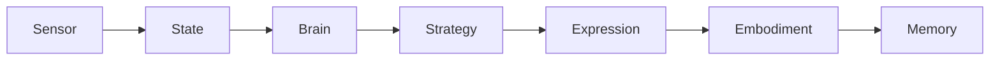

# 🏗️ 아키텍처 가이드 및 설계 지침 (Architecture Guidelines)

> **"이 프로젝트는 단순한 코드 덩어리가 아니라, 판단 구조를 가진 유기체입니다."**

이 문서는 프로젝트 담당자가 반드시 지켜야 할 **설계 원칙**과 **아키텍처 철학**을 설명합니다.
기능을 추가하거나 코드를 수정할 때 본 지침을 위반하지 않도록 주의하십시오.

이 프로젝트가 경계하는 것
즉흥적인 if-else 분기 추가
UI에서 상태를 추측하는 코드
“일단 되니까”라는 이유의 레이어 침범

이 원칙을 위반할 경우
시스템은 행동 원인 추적 불가, 디버깅 불가능 상태,
그리고 학습 데이터의 신뢰성 붕괴를 초래합니다.
---

## 1. 핵심 아키텍처: 7 Layer Pipeline

이 시스템은 단방향으로 흐르는 7단계 파이프라인으로 구성됩니다.

1.  **Sensor (감각)**: "무엇이 보이는가?" (PerceptionManager)
2.  **State (상태)**: "나는 지금 어떤 상황인가?" (SystemState)
3.  **Brain (판단)**: "무엇을 하고 싶은가?" (LogicBrain/Tools)
4.  **Strategy (전략)**: "내 성격에 이게 맞는가?" (StrategyManager)
5.  **Expression (표현)**: "어떻게 움직일 것인가?" (EmotionController)
6.  **Embodiment (구현)**: "실제로 보여주자." (RobotController/Frontend)
7.  **Memory (기억)**: "결과는 어땠는가?" (FalkorDB)

---

## 2. 절대 타협할 수 없는 3가지 원칙

### 원칙 1. No Reverse Flow (역류 금지)
*   **규칙**: 하위 레이어는 상위 레이어를 절대 참조(Import)해서는 안 됩니다.
*   **이유**: 역방향 의존성이 생기는 순간, 시스템은 '단순 루프'가 아니라 '스파게티 코드'가 되며 예측 불가능해집니다.
*   **예시**:
    *   (O) `Brain`이 `State`를 읽음.
    *   (X) `State`가 `Brain`의 함수를 호출함.
    *   (X) `UI(Embodiment)`가 `Brain`의 상태를 직접 변경함.

### 원칙 2. Strict Interfaces (엄격한 인터페이스)
*   **규칙**: 레이어 간 데이터 전달은 반드시 정의된 **DTO(Data Transfer Object)**나 **메시지 패킷**으로만 이루어져야 합니다.
*   **이유**: 레이어 내부 구현이 바뀌어도 인터페이스가 유지되면 전체 시스템은 안전합니다.
*   **예시**:
    *   Sensor는 `SensorFrame` 객체만 내보냅니다.
    *   Brain은 `PolicyDecision` 객체만 내보냅니다.

### 원칙 3. UI is Dumb (멍청한 UI)
*   **규칙**: UI나 모터 제어 코드(Embodiment)에는 어떠한 **판단 로직(if-else)**도 들어가선 안 됩니다.
*   **이유**: "화난 표정을 짓는다"는 판단은 Brain이나 Strategy가 하는 것이지, UI 컴포넌트가 결정할 일이 아닙니다. UI는 전달받은 파라미터(예: `eyebrow_angle=30`)를 렌더링만 해야 합니다.

---

## 3. 코드 작성 가이드라인

### 3.1 상태 관리
*   전역 변수 사용을 지양하고, `SystemState` 객체를 통해 상태를 중앙 관리하십시오.
*   상태 변경은 오직 파이프라인의 흐름에 따라서만 발생해야 합니다.

### 3.2 확장성
*   새로운 기능을 추가할 때는 **"어느 레이어에 속하는가?"**를 먼저 고민하십시오.
    *   새로운 센서 추가 -> `sensor/`
    *   새로운 행동 패턴 추가 -> `brain/` 또는 `strategy/`
    *   새로운 표정 추가 -> `expression/`

### 3.3 주석 및 언어
*   모든 코드는 **한국어 주석**을 원칙으로 합니다.
*   복잡한 알고리즘(특히 Vision, Physics 관련)은 주석으로 수식이나 의도를 명확히 설명해야 합니다.

---

## 4. 인수인계 체크리스트

다음 담당자에게 프로젝트를 넘길 때 확인해야 할 사항입니다.

- [ ] `docs/PROJECT_STRUCTURE.md`가 현재 폴더 구조와 일치하는가?
- [ ] `environment.yml` 하나로 가상환경 셋업이 한 번에 끝나는가?
- [ ] 모든 레이어 간의 의존성이 단방향으로 유지되고 있는가?
- [ ] 주요 로직에 대한 한국어 주석이 최신화되어 있는가?