# 🏗️ 아키텍처 설계 및 적용 현황 (Architecture Status)

2026.02.04 기준

## 1. 핵심 아키텍처: 7 Layer Pipeline 적용 현황
이 시스템은 단방향으로 흐르는 7단계 파이프라인으로 구성되며, 현재 각 레이어의 적용 상태는 다음과 같습니다.

```mermaid
graph LR
    Sensor["Sensor (L1)"] -- "PerceptionPacket" --> State["State (L2)"]
    State -- "SystemSnapshot" --> Brain["Brain (L3)"]
    Brain -- "ActionIntent" --> Strategy["Strategy (L4)"]
    Strategy -- "PoliteAction" --> Expression["Expression (L5)"]
    Expression -- "MotionCommand" --> Embodiment["Embodiment (L6)"]
    Embodiment -- "Result/Log" --> Memory["Memory (L7)"]
    
    style Sensor fill:#f9f,stroke:#333,stroke-width:2px
```

### 레이어별 현재 역할 (Current Implementation)
1.  **Sensor (L1)**: **[개선 완료]** `VisionBridge`를 통해 Sim/Real 영상을 획득하고 YOLOv11로 객체를 탐지하여 3D 좌표를 산출합니다. RealSense 드라이버의 타임아웃 처리가 개선되었으며(3초), IMU 데이터 API가 일관성 있게 수정되었습니다.
2.  **State (L2)**: **[운용 중]** `system_state.py`가 모든 레이어의 공통 참조 데이터를 중앙 관리합니다.
3.  **Brain (L3)**: **[운용 중]** LogicBrain이 LLM과 연동하여 작업의 의도를 결정합니다.
4.  **Strategy (L4)**: **[고도화 완료]** 'Intelligent Eye' 능동 인지 상태 기계 및 비주얼 서보잉이 통합되었습니다.
5.  **Expression (L5)**: **[리뉴얼 완료]** 16종의 고유 모션을 가진 동적 프리셋이 탑재되어 있으며, `FaceContext`를 통해 실시간 렌더링됩니다.
6.  **Embodiment (L6)**: **[운용 중]** 실물 로봇 및 PyBullet 시뮬레이터와 직접 통신하며, 3초 타임아웃의 빠른 폴백을 지원합니다.
7.  **Memory (L7)**: **[운용 중]** FalkorDB를 통해 과거의 행동 결과를 그래프 데이터로 저장합니다.

---

## 2. 준수 중인 설계 원칙 (Design Principles)

### ✅ No Reverse Flow (역류 금지)
*   **현황**: 하위 레이어가 상위 레이어를 직접 Import하는 위반 사례를 `sensor` 레이어 리팩토링 과정에서 모두 제거했습니다. 데이터는 오직 `broadcaster`나 `system_state`를 통해서만 상향 전달됩니다.

### ✅ Strict Interfaces (엄격한 인터페이스)
*   **현황**: 레이어 간 데이터 전달은 `shared/ui_dto.py` 및 전용 패킷 구조를 통해서만 이루어지도록 강제하고 있습니다.

### ✅ UI is Dumb (판단 로직 분리)
*   **현황**: 프론트엔드와 하드웨어 드라이버 수준에서의 `if-else` 판단을 최소화하고, 모든 결정권은 `Brain`과 `Strategy` 계층으로 집중시키고 있습니다.

### ✅ Concurrency Safety (스레드 안전성)
*   **현황**: `RLock` 및 락 프리 브로드캐스트 설계를 통해 멀티 스레드 환경에서의 데드락을 방지하고 시스템 프리징을 해결했습니다.

---
*본 문서는 프로젝트의 설계 무결성을 모니터링하기 위해 지속적으로 업데이트됩니다.*
