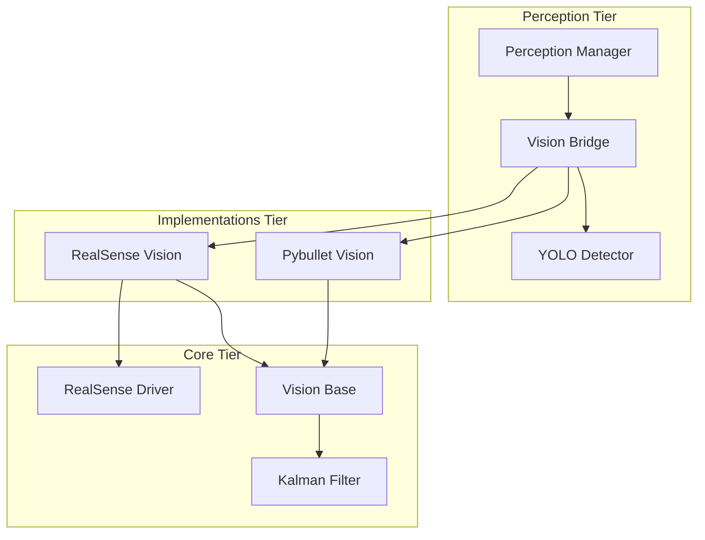

# 📡 Sensor Layer (Layer 1)

센서 레이어는 외부 세계(실물 하드웨어 또는 시뮬레이션 환경)로부터 정보를 수집하여 로봇이 인지할 수 있는 가공된 데이터로 변환하는 MACH_VII v2.0의 최하단 기초 계층입니다.

---

## 🏗 아키텍처 구조 (3-Tier)

본 레이어는 유연성과 유지보수성을 극대화하기 위해 다음과 같은 3계층 구조로 설계되었습니다.



### 1. Core Tier (`sensor/core/`)
시스템의 기반이 되는 표준과 하드웨어 드라이버를 포함합니다.
*   **[`vision_base.py`](file:///d:/ARMY/MACH_VII_v2.0/sensor/core/vision_base.py)**: 모든 비전 시스템의 모태 클래스입니다. **X-Y-Z 좌표별 칼만 필터(Kalman Filter)**를 내장하여 데이터 떨림을 근본적으로 제거합니다.
*   **[`realsense_driver.py`](file:///d:/ARMY/MACH_VII_v2.0/sensor/core/realsense_driver.py)**: RealSense SDK(pyrealsense2)와 직접 통신하며, 실제 하드웨어의 렌즈 파라미터(Intrinsics)를 추출하여 정밀 제어를 지원합니다.

### 2. Implementations Tier (`sensor/implementations/`)
특정 환경에 특화된 비전 데이터 획득 로직을 구현합니다.
*   **[`realsense_vision.py`](file:///d:/ARMY/MACH_VII_v2.0/sensor/implementations/realsense_vision.py)**: 실물 로봇 환경을 위한 구현체로, SDK 파라미터를 기반으로 픽셀을 3D 좌표로 변환합니다.
*   **[`pybullet_vision.py`](file:///d:/ARMY/MACH_VII_v2.0/sensor/implementations/pybullet_vision.py)**: 시뮬레이션 환경을 위한 구현체로, **Oracle Depth**와 **Phantom Detection 차단** 로직을 통해 시뮬레이션 오차를 완벽히 극복합니다.

### 3. Perception Tier (`sensor/perception/`)
수집된 저수준 데이터를 고수준 인지 정보로 가공하고 전파합니다.
*   **[`yolo_detector.py`](file:///d:/ARMY/MACH_VII_v2.0/sensor/perception/yolo_detector.py)**: YOLOv11 모델을 사용하여 실시간 객체 탐지를 수행합니다.
*   **[`vision_bridge.py`](file:///d:/ARMY/MACH_VII_v2.0/sensor/perception/vision_bridge.py)**: 2D 픽셀을 3D cm 좌표로 변환하는 '핵심 중계자'입니다. **Adaptive Depth Estimation(Median + Std)** 기법을 사용하여 물체의 입체 중심을 조준합니다.
*   **[`perception_manager.py`](file:///d:/ARMY/MACH_VII_v2.0/sensor/perception/perception_manager.py)**: 비전 루프를 총괄하며, 가공된 데이터를 `system_state`에 기록하고 시스템 전반에 이벤트를 발행(Broadcasting)합니다.

---

## 🛠 주요 기술 스택 및 특징

1.  **정밀 좌표 변환 (Precision Transformation)**
    *   **Kalman Filtering**: 베이스 클래스에 내재화된 필터링을 통해 하드웨어 노이즈 및 좌표 튀는 현상 방지.
    *   **Adaptive Depth**: 물체의 표면 거리가 아닌, 통계적 분석을 통한 '실제 중심' 깊이 산출.

2.  **하드웨어 정밀 연동 (Hardware Sync)**
    *   **SDK-Direct Intrinsics**: 카메라 소스별 고유 렌즈 특성을 실시간으로 반영하여 오차 최소화.
    *   **IMU Expansion Ready**: 향후 하드웨어 기울기 보정을 위한 확장성 주석 완비.

3.  **구조적 최적화 (Structural Optimization)**
    *   **Unified Loop Control**: 중복된 업데이트 루프를 제거하고 `PerceptionManager` 하나로 통합하여 CPU 자원 사용 최적화.
    *   **Multi-Camera Fusion**: `Main`(월드) 카메라와 `Gripper`(정밀) 카메라 스트림을 동시 처리하며, `DynamicKinematics`를 통한 실시간 회전 보정을 지원합니다.
    *   **Intelligent Active Perception**: VLM 피드백 기반의 능동적 시점 탐색 스택(`Intelligent Eye`)과 연동되어 임무 성공률을 극대화합니다.

---

## 📖 사용 방법

다른 레이어에서 비전 정보를 사용할 때는 해당 모듈만 간단히 임포트하여 사용합니다.

```python
# 인식된 사물 리스트 가져오기 (가공된 3D 좌표 포함)
from sensor.perception import vision_bridge
objects = vision_bridge.get_refined_detections()

# 비전 루프 제어 (관리자 소환)
from sensor.perception import perception_manager
perception_manager.start()
```

---

## ⚙️ 작동 흐름 (Data Flow)
1. **Perception** 레이어의 `perception_manager`가 루프를 시작합니다.
2. `VisionBridge`는 현재 설정된 **Implementations** (Sim/Real)를 통해 영상을 가져옵니다.
3. `YoloDetector`가 사물을 인식하면, **VisionBridge** 내의 **Adaptive Depth Estimation** 및 **Kalman Filter**를 거쳐 정밀한 3D 좌표로 변환됩니다.
4. 최종 결과는 `shared/broadcaster`를 통해 공유되고 `state/system_state`에 기록됩니다.

---

## 🔗 상속 및 관계
- **사용처**: `brain/tools` (탐지 요청), `strategy` (작업 계획), `interface` (UI 스트리밍)
- **의존성**: `shared/config`, `shared/state_broadcaster`, `state/system_state`
